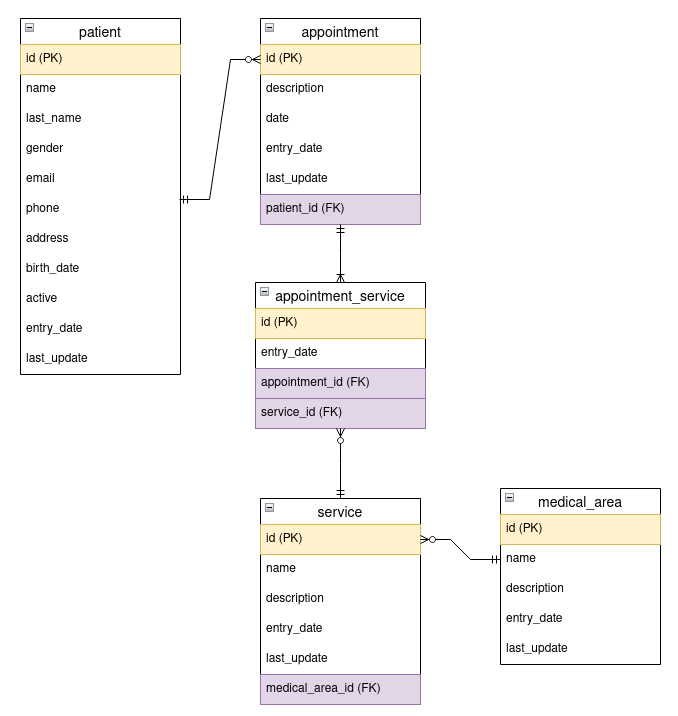

# medical-appointments-api
---
## Table of Contents
1. [Run guide](#id-section1)
   1. [MySQL](#id-section1.1)
   2. [Medical Appoitments Api](#id-section1.2)
2. [Database Model](#id-section2)
3. [API Documentation](#id-section3)
4. [Postman Project](#id-section4)

<div id='id-section1'/>
### Run guide

In this section you are going to see how to run the application including the MySQL database that it use.

<div id='id-section1.1'/>
####  MySQL

For portability reasons, everything to do with the database was dockerized. This is the reason of the ```docker``` folder.

This first thing that we have to do is enter to this folder.

```
cd ./docker
```

Inside this, we will find the next files:
* ```data.sql```: File with all the SQL code needed to create the medical appointments DB.
* ```database-script.sh```: Bash script that help to create the mysql container.
* ```Dockerfile```: Dockerfile of the medical-db image.
  
To beginning, you need to build the database image. You can do this executing the next command:

```
sudo docker build -t <image name> .
e.g: sudo docker build -t medical-db .
```

After the image was build sucessfuly, the database container can be created using the ```database-script.sh```. It can be executed by putting these commands in the terminal:

```
chmod u+x ./database-script.sh
sudo ./database-script.sh
```

Is important to highlight that you have to fill the next values in the ```database-script.sh``` file before it is executed:

```
CONTAINER_NAME="";
CONTAINER_IMAGE="";
DATABASE_PASSWORD="";
DATABASE_PORT=;

e.g:
CONTAINER_NAME="mysql-db";
CONTAINER_IMAGE="medical-db";
DATABASE_PASSWORD="my_password";
DATABASE_PORT=3306;
```

After that, the database container should be created and you can connect to it using the regarding credentials. The connection could be made using a database IDE like [DBeaver](https://dbeaver.io/) or the next Docker command:

```
sudo docker exec -it <container name> mysql -p
e.g: sudo docker exec -it mysql-db mysql -p
```

**NOTE:**
This process don't take into account the use of Docker volumes to persist the data. If you want to make the data persistent, you have to create and assign a docker volume in the container creation.

#####  Alternatives

If for any reason some of the previous step fails (due to the OS or something else), you can try the next solutions to get the database up and running:

* If the image was created sucessfuly, you can create the container by executing this command:
  ```
  sudo docker run -d -p <port>:3306 --name <container name> -e MYSQL_ROOT_PASSWORD=<password> <image name>
  e.g: sudo docker run -d -p 3306:3306 --name mysql-db -e MYSQL_ROOT_PASSWORD=my_password medical-db

  Using a volume:
  sudo docker run -d -p <port>:3306 --name <container name> -e MYSQL_ROOT_PASSWORD=<password> --mount src=<volume name>,dst=<local path> <image name>
  e.g: sudo docker run -d -p 3306:3306 --name mysql-db -e MYSQL_ROOT_PASSWORD=my_password --mount src=my-volume,dst=/var/lib/mysql medical-db
  ```
* If the image wasn't created sucessfuly, you can create the container and database by following this steps:
  * Create a mysql container with the next command:
    ```
    sudo docker run -d -p <port>:3306 --name <container name> -e MYSQL_ROOT_PASSWORD=<password> mysql
    e.g: sudo docker run -d -p 3306:3306 --name mysql-db -e MYSQL_ROOT_PASSWORD=my_password mysql
    ```
  * Use a database IDE for:
    * Create the dabase.
    * Execute the ```creates.sql``` file (```database``` folder) inside the database.
    * Execute the ```inserts.sql``` file (```database``` folder) inside the database.
  
<div id='id-section1.2'/>
#### Medical Appoitments Api

Regarding to the Medical Appointments Api, you first have to install all the dependencies inside the ```application``` folder by using these commands:

```
cd ./application
npm install
```

Also, you will have to create inside this folder the ```.env``` file with the next environment variables:

```
APP_PORT=
DATABASE_NAME=
DATABASE_PORT=
DATABASE_HOST=
DATABASE_USER=
DATABASE_PASSWORD=

e.g:
APP_PORT=3000
DATABASE_NAME=medical_appointments_db
DATABASE_PORT=3306
DATABASE_HOST=localhost
DATABASE_USER=root
DATABASE_PASSWORD=my_password
```

After this, you can run the application by running the command:

```
npm run start
```

<div id='id-section2'/>
### Database Model

The Database Model of the application is presented in the next image:


<div id='id-section3'/>
### API Documentation

In this section all the created resources in the application will be explained.

**NOTE**:
As a design decision, the error "Resource not found" could bring with two error codes: 400 and 404. This will be determinate by this two criterias:
* If the purpose of the operation is to get the resource (GET), you will get error 404 code if the resource is not found.
* If the purpose of the operation is to perform other action than get the resource (POST, PATCH, DELETE, etc), you will get error 400 code if one of the needed resources is not found.

#### POST - PATIENT
**URI**: ```/medical-appointments-api/v1/patients```
* Request:
  ```
  POST http://localhost:3000/medical-appointments-api/v1/patients
  ```
  ```JSON
  {
    "name": "Gabriel",
    "lastName": "Teran",
    "gender": "M",
    "email": "gabo15@gmail.com",
    "phone": "+58 4245878985",
    "address": "El Junquito",
    "birthDate": "1999-07-03"
  }
  ```
* Response:
  ```JSON
  {
    "apiVersion": "v1",
    "statusCode": 201,
    "timestamp": "2022-12-06T01:24:44.202Z",
    "data": {
        "id": 5,
        "name": "Gabriel",
        "lastName": "Teran",
        "email": "gabo15@gmail.com",
        "gender": "M",
        "phone": "+58 4245878985",
        "address": "El Junquito",
        "birthDate": "1999-07-03",
        "active": true,
        "entryDate": "2022-12-06T05:24:44.000Z",
        "lastUpdate": "2022-12-06T05:24:44.000Z"
    }
  }
  ```
* Notes:
  * Errors due to data type validation are not shown in this documentation.
#### GET - PATIENT
**URI**: ```/medical-appointments-api/v1/patients/:patientId```
* Request:
  ```
  GET http://localhost:3000/medical-appointments-api/v1/patients/5
  ```
* Response:
  ```JSON
  {
    "apiVersion": "v1",
    "statusCode": 200,
    "timestamp": "2022-12-06T01:31:26.015Z",
    "data": {
        "id": 5,
        "name": "Gabriel",
        "lastName": "Teran",
        "email": "gabo15@gmail.com",
        "gender": "M",
        "phone": "+58 4245878985",
        "address": "El Junquito",
        "birthDate": "1999-07-03T04:00:00.000Z",
        "active": true,
        "entryDate": "2022-12-06T05:24:44.000Z",
        "lastUpdate": "2022-12-06T05:24:44.000Z"
    }
  }
  ```
* Alternative Responses:
  ```JSON
  {
    "apiVersion": "v1",
    "statusCode": 404,
    "timestamp": "2022-12-06T01:34:22.095Z",
    "error": {
        "statusCode": 404,
        "message": "Patient Not Found"
    }
  }
  ```
* Notes:
  * This endpoint can return inactive patients.
#### PATCH - PATIENT
**URI**: ```/medical-appointments-api/v1/patients/:patientId```
* Request:
  ```
  PATCH http://localhost:3000/medical-appointments-api/v1/patients/5
  ```
  ```JSON
  {
    "name": "Gabriel",
    "lastName": "Teran",
    "gender": "M",
    "email": "gabo.t12@gmail.com",
    "phone": "+58 4245878985",
    "address": "El Junquito",
    "birthDate": "1999-05-12",
    "active": false
  }
  ```
* Response:
  ```JSON
  {
    "apiVersion": "v1",
    "statusCode": 200,
    "timestamp": "2022-12-06T01:39:53.041Z",
    "data": {
        "id": 5,
        "name": "Gabriel",
        "lastName": "Teran",
        "email": "gabo.t12@gmail.com",
        "gender": "M",
        "phone": "+58 4245878985",
        "address": "El Junquito",
        "birthDate": "1999-05-12T04:00:00.000Z",
        "active": false,
        "entryDate": "2022-12-06T05:24:44.000Z",
        "lastUpdate": "2022-12-06T05:39:53.000Z"
    }
  }
  ```
* Alternative Responses:
  ```JSON
  {
    "apiVersion": "v1",
    "statusCode": 400,
    "timestamp": "2022-12-06T01:37:41.552Z",
    "error": {
        "statusCode": 400,
        "message": "Patient Not Found"
    }
  }
  ```
* Notes:
  * This endpoint can be used to inactivate or activate patients.
  * Errors due to data type validation are not shown in this documentation.
#### DELETE - PATIENT
**URI**: ```/medical-appointments-api/v1/patients/:patientId```
* Request:
  ```
  DELETE http://localhost:3000/medical-appointments-api/v1/patients/5
  ```
* Response:
  ```JSON
  {
    "apiVersion": "v1",
    "statusCode": 200,
    "timestamp": "2022-12-05T02:39:34.959Z",
    "data": {
        "raw": [],
        "affected": 1
    }
  }
  ```
* Alternative Responses:
  ```JSON
  {
    "apiVersion": "v1",
    "statusCode": 400,
    "timestamp": "2022-12-06T01:44:13.814Z",
    "error": {
        "statusCode": 400,
        "message": "Patient Not Found"
    }
  }
  ```
* Notes:
  * This endpoint can be used to delete both active and inactive patients.
#### POST - APPOINTMENT
**URI**: ```/medical-appointments-api/v1/patients/:patientId/appointments```
* Request:
  ```
  POST http://localhost:3000/medical-appointments-api/v1/patients/5/appointments
  ```
  ```JSON
  {
    "description": "Brain tomography and Magnetic resonance",
    "date": "2022-12-06",
    "appointmentServices": [
        {
            "service": {
                "id": 1
            }
        }
    ]
  }
  ```
* Response:
  ```JSON
  {
    "apiVersion": "v1",
    "statusCode": 201,
    "timestamp": "2022-12-06T01:56:39.808Z",
    "data": {
        "id": 4,
        "description": "Brain tomography",
        "date": "2022-12-06",
        "entryDate": "2022-12-06T05:56:39.000Z",
        "lastUpdate": "2022-12-06T05:56:39.000Z",
        "appointmentServices": [
            {
                "service": {
                    "id": 1
                },
                "id": 5,
                "entryDate": "2022-12-06T05:56:39.000Z"
            }
        ],
        "patient": {
            "id": 5
        }
    }
  }
  ```
* Alternative Responses:
  ```JSON
  {
    "apiVersion": "v1",
    "statusCode": 400,
    "timestamp": "2022-12-06T01:53:05.656Z",
    "error": {
        "statusCode": 400,
        "message": "Patient Not Found"
    }
  }
  ```
  ```JSON
  {
    "apiVersion": "v1",
    "statusCode": 400,
    "timestamp": "2022-12-06T01:51:57.518Z",
    "error": {
        "statusCode": 400,
        "message": "Appointments for inactive patients cannot be created"
    }
  }
  ```
  ```JSON
  {
    "apiVersion": "v1",
    "statusCode": 400,
    "timestamp": "2022-12-06T01:55:39.502Z",
    "error": {
        "statusCode": 400,
        "message": "The appointment must have attached services"
    }
  }
  ```
  ```JSON
  {
    "apiVersion": "v1",
    "statusCode": 400,
    "timestamp": "2022-12-06T01:55:16.125Z",
    "error": {
        "statusCode": 400,
        "message": "Some of the sent services don't exist"
    }
  }
  ```
* Notes:
  * The endpoint is able to attach services to the appointment.
  * Errors due to data type validation are not shown in this documentation.
#### UPDATE - APPOINTMENT
**URI**: ```/medical-appointments-api/v1/patients/:patientId/appointments/:appointmentId```
* Request:
  ```
  PATCH http://localhost:3000/medical-appointments-api/v1/patients/5/appointments/4
  ```
  ```JSON
  {
    "description": "Brain tomography and Magnetic resonance",
    "date": "2022-12-08",
    "appointmentServices": [
        {
            "service": {
                "id": 1
            }
        },
        {
            "service": {
                "id": 2
            }
        }
    ]
  }
  ```
* Response:
  ```JSON
  {
    "apiVersion": "v1",
    "statusCode": 200,
    "timestamp": "2022-12-06T02:06:04.809Z",
    "data": {
        "id": 4,
        "description": "Brain tomography and Magnetic resonance",
        "date": "2022-12-08",
        "lastUpdate": "2022-12-06T06:06:04.000Z",
        "appointmentServices": [
            {
                "id": 5,
                "entryDate": "2022-12-06T05:56:39.000Z",
                "service": {
                    "id": 1,
                    "name": "Brain tomography",
                    "description": "Computed tomography of the head using a series of X-rays",
                    "entryDate": "2022-12-06T05:18:31.000Z",
                    "lastUpdate": "2022-12-06T05:18:31.000Z"
                }
            },
            {
                "id": 6,
                "entryDate": "2022-12-06T06:06:04.000Z",
                "service": {
                    "id": 2,
                    "name": "Magnetic resonance",
                    "description": "Technique used in radiology to form pictures of the anatomy and the physiological processes of the body",
                    "entryDate": "2022-12-06T05:18:31.000Z",
                    "lastUpdate": "2022-12-06T05:18:31.000Z"
                }
            }
        ],
        "patient": {
            "id": 5
        }
    }
  }
  ```
* Alternative Responses:
  ```JSON
  {
    "apiVersion": "v1",
    "statusCode": 400,
    "timestamp": "2022-12-06T02:09:10.951Z",
    "error": {
        "statusCode": 400,
        "message": "Patient Not Found"
    }
  }
  ```
  ```JSON
  {
    "apiVersion": "v1",
    "statusCode": 400,
    "timestamp": "2022-12-06T02:10:32.200Z",
    "error": {
        "statusCode": 400,
        "message": "Appointments for inactive patients cannot be updated"
    }
  }
  ```
  ```JSON
  {
    "apiVersion": "v1",
    "statusCode": 400,
    "timestamp": "2022-12-06T02:11:14.088Z",
    "error": {
        "statusCode": 400,
        "message": "The appointment must have attached services"
    }
  }
  ```
  ```JSON
  {
    "apiVersion": "v1",
    "statusCode": 400,
    "timestamp": "2022-12-06T02:11:33.519Z",
    "error": {
        "statusCode": 400,
        "message": "Appointment Not Found"
    }
  }
  ```
  ```JSON
  {
    "apiVersion": "v1",
    "statusCode": 400,
    "timestamp": "2022-12-06T02:11:58.085Z",
    "error": {
        "statusCode": 400,
        "message": "Some of the sent services don't exist"
    }
  }
  ```
* Notes:
  * The endpoint is able to add or delete services to the appointment according to the sent payload.
  * Errors due to data type validation are not shown in this documentation.
#### DELETE - APPOINTMENT
**URI**: ```/medical-appointments-api/v1/patients/:patientId/appointments/:appointmentId```
* Request:
  ```
  DELETE http://localhost:3000/medical-appointments-api/v1/patients/5/appointments/4
  ```
* Response:
  ```JSON
  {
    "apiVersion": "v1",
    "statusCode": 200,
    "timestamp": "2022-12-06T02:15:18.519Z",
    "data": {
        "raw": [],
        "affected": 1
    }
  }
  ```
* Alternative Responses:
  ```JSON
  {
    "apiVersion": "v1",
    "statusCode": 400,
    "timestamp": "2022-12-06T02:17:32.923Z",
    "error": {
        "statusCode": 400,
        "message": "Patient Not Found"
    }
  }
  ```
  ```JSON
  {
    "apiVersion": "v1",
    "statusCode": 400,
    "timestamp": "2022-12-06T02:17:50.982Z",
    "error": {
        "statusCode": 400,
        "message": "Appointment Not Found"
    }
  }
  ```
  ```JSON
  {
    "apiVersion": "v1",
    "statusCode": 400,
    "timestamp": "2022-12-06T02:18:19.321Z",
    "error": {
        "statusCode": 400,
        "message": "Past appointments can't be deleted"
    }
  }
  ```
#### GET - PATIENT APPOINTMENTS
**URI**: ```/medical-appointments-api/v1/patients/:patientId/appointments```
* Request:
  ```
  GET http://localhost:3000/medical-appointments-api/v1/patients/1/appointments?startDate=1999-02-02&endDate=2023-02-05
  ```
* Response:
  ```JSON
  {
    "apiVersion": "v1",
    "statusCode": 200,
    "timestamp": "2022-12-06T02:23:24.664Z",
    "data": {
        "patientId": 1,
        "startDate": "1999-02-02T00:00:00.000Z",
        "endDate": "2023-02-05T00:00:00.000Z",
        "appointments": [
            {
                "id": 1,
                "description": "Brain tomography and Magnetic resonance",
                "date": "2022-12-06T04:00:00.000Z",
                "entryDate": "2022-12-06T05:18:31.000Z",
                "lastUpdate": "2022-12-06T05:18:31.000Z"
            },
            {
                "id": 5,
                "description": "Brain tomography and Magnetic resonance",
                "date": "2022-12-15T04:00:00.000Z",
                "entryDate": "2022-12-06T06:23:12.000Z",
                "lastUpdate": "2022-12-06T06:23:12.000Z"
            }
        ],
        "limit": 20,
        "offset": 0
    }
  }
  ```
* Alternative Responses:
  ```JSON
  {
    "apiVersion": "v1",
    "statusCode": 400,
    "timestamp": "2022-12-06T02:22:12.543Z",
    "error": {
        "statusCode": 400,
        "message": "The start date is reqired"
    }
  }
  ```
  ```JSON
  {
    "apiVersion": "v1",
    "statusCode": 400,
    "timestamp": "2022-12-06T02:22:25.964Z",
    "error": {
        "statusCode": 400,
        "message": "The end date is reqired"
    }
  }
  ```
  ```JSON
  {
    "apiVersion": "v1",
    "statusCode": 404,
    "timestamp": "2022-12-06T02:22:41.852Z",
    "error": {
        "statusCode": 404,
        "message": "Patient Not Found"
    }
  }
  ```
* Notes:
  * The endpoint receive the next query params:
    * startDate: required.
    * endDate: required.
    * limit: optional (default 20).
    * offset: optional (default 0).
#### GET - MEDICAL AREA
**URI**: ```/medical-appointments-api/v1/medical-areas/:medicalAreaId```
* Request:
  ```
  GET http://localhost:3000/medical-appointments-api/v1/medical-areas/1
  ```
* Response:
  ```JSON
  {
    "apiVersion": "v1",
    "statusCode": 200,
    "timestamp": "2022-12-06T02:28:58.072Z",
    "data": {
        "id": 1,
        "name": "Medical imaging",
        "description": "Technique and process of imaging the interior of a body for clinical analysis",
        "entryDate": "2022-12-06T05:18:31.000Z",
        "lastUpdate": "2022-12-06T05:18:31.000Z",
        "services": [
            {
                "id": 1,
                "name": "Brain tomography",
                "description": "Computed tomography of the head using a series of X-rays",
                "entryDate": "2022-12-06T05:18:31.000Z",
                "lastUpdate": "2022-12-06T05:18:31.000Z"
            },
            {
                "id": 2,
                "name": "Magnetic resonance",
                "description": "Technique used in radiology to form pictures of the anatomy and the physiological processes of the body",
                "entryDate": "2022-12-06T05:18:31.000Z",
                "lastUpdate": "2022-12-06T05:18:31.000Z"
            }
        ]
    }
  }
  ```
* Alternative Responses:
  ```JSON
  {
    "apiVersion": "v1",
    "statusCode": 404,
    "timestamp": "2022-12-06T02:30:11.784Z",
    "error": {
        "statusCode": 404,
        "message": "Medical Area not found"
    }
  }
  ```
#### POST - SERVICE
**URI**: ```/medical-appointments-api/v1/medical-areas/:medicalAreaId/services```
* Request:
  ```
  POST http://localhost:3000/medical-appointments-api/v1/medical-areas/1/services
  ```
  ```JSON
  {
    "name": "X-Ray",
    "description": "Practice of producing two-dimensional images using X-ray radiation"
  }
  ```
* Response:
  ```JSON
  {
    "apiVersion": "v1",
    "statusCode": 201,
    "timestamp": "2022-12-06T02:32:59.671Z",
    "data": {
        "id": 3,
        "name": "X-Ray",
        "description": "Practice of producing two-dimensional images using X-ray radiation",
        "entryDate": "2022-12-06T06:32:59.000Z",
        "lastUpdate": "2022-12-06T06:32:59.000Z",
        "medicalArea": {
            "id": 1
        }
    }
  }
  ```
* Alternative Responses:
  ```JSON
  {
    "apiVersion": "v1",
    "statusCode": 400,
    "timestamp": "2022-12-06T02:33:27.091Z",
    "error": {
        "statusCode": 400,
        "message": "Medical Area not found"
    }
  }
  ```
* Notes:
  * Errors due to data type validation are not shown in this documentation.
#### PATCH - SERVICE
**URI**: ```/medical-appointments-api/v1/medical-areas/:medicalAreaId/services/:serviceId```
* Request:
  ```
  PATCH http://localhost:3000/medical-appointments-api/v1/medical-areas/1/services/3
  ```
  ```JSON
  {
    "name": "Y-Ray",
    "description": "Practice of producing two-dimensional images using Y-ray radiation"
  }
  ```
* Response:
  ```JSON
  {
    "apiVersion": "v1",
    "statusCode": 200,
    "timestamp": "2022-12-06T02:36:08.643Z",
    "data": {
        "id": 3,
        "name": "Y-Ray",
        "description": "Practice of producing two-dimensional images using Y-ray radiation",
        "entryDate": "2022-12-06T06:32:59.000Z",
        "lastUpdate": "2022-12-06T06:36:08.000Z"
    }
  }
  ```
* Alternative Responses:
  ```JSON
  {
    "apiVersion": "v1",
    "statusCode": 400,
    "timestamp": "2022-12-06T02:36:57.801Z",
    "error": {
        "statusCode": 400,
        "message": "Medical Area not found"
    }
  }
  ```
  ```JSON
  {
    "apiVersion": "v1",
    "statusCode": 400,
    "timestamp": "2022-12-06T02:37:12.723Z",
    "error": {
        "statusCode": 400,
        "message": "Service Not Found"
    }
  }
  ```
* Notes:
  * Errors due to data type validation are not shown in this documentation.
#### DELETE - SERVICE
**URI**: ```/medical-appointments-api/v1/medical-areas/:medicalAreaId/services/:serviceId```
* Request:
  ```
  DELETE http://localhost:3000/medical-appointments-api/v1/medical-areas/1/services/3
  ```
* Response:
  ```JSON
  {
    "apiVersion": "v1",
    "statusCode": 200,
    "timestamp": "2022-12-06T02:40:22.071Z",
    "data": {
        "raw": [],
        "affected": 1
    }
  }
  ```
* Alternative Responses:
  ```JSON
  {
    "apiVersion": "v1",
    "statusCode": 400,
    "timestamp": "2022-12-06T02:40:44.455Z",
    "error": {
        "statusCode": 400,
        "message": "Medical Area not found"
    }
  }
  ```
  ```JSON
  {
    "apiVersion": "v1",
    "statusCode": 400,
    "timestamp": "2022-12-06T02:40:55.691Z",
    "error": {
        "statusCode": 400,
        "message": "Service Not Found"
    }
  }
  ```
  ```JSON
  {
    "apiVersion": "v1",
    "statusCode": 400,
    "timestamp": "2022-12-06T02:41:09.363Z",
    "error": {
        "statusCode": 400,
        "message": "Services with appointments can't be deleted"
    }
  }
  ```

<div id='id-section4'/>
### Postman Project

For easy testing, a Postman project can be found in the ```postman``` folder.


